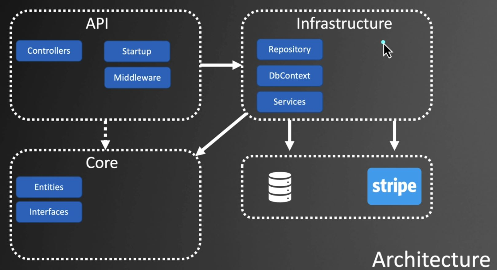
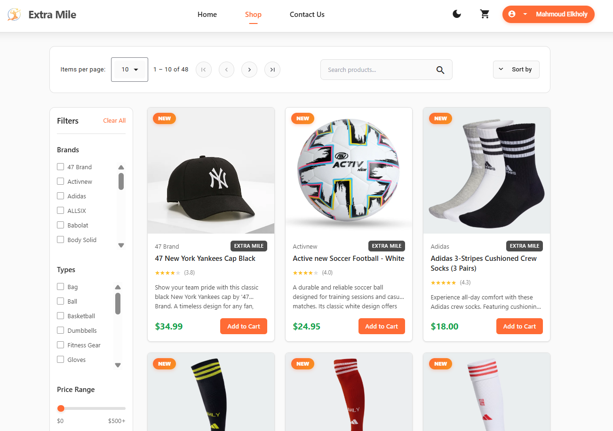
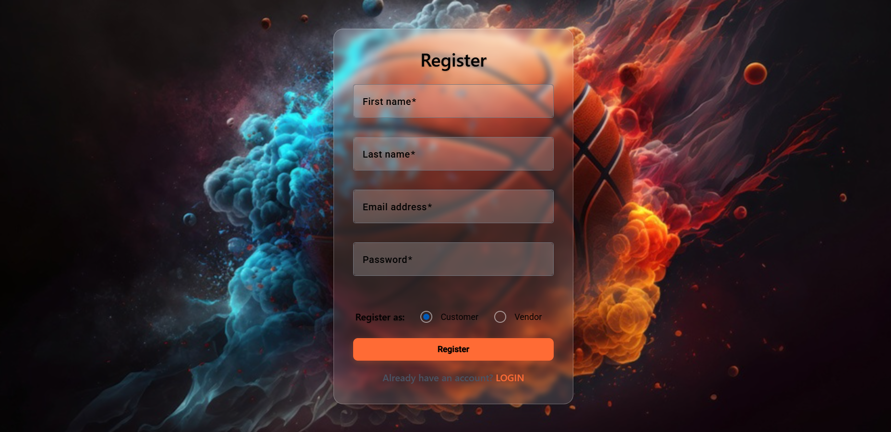
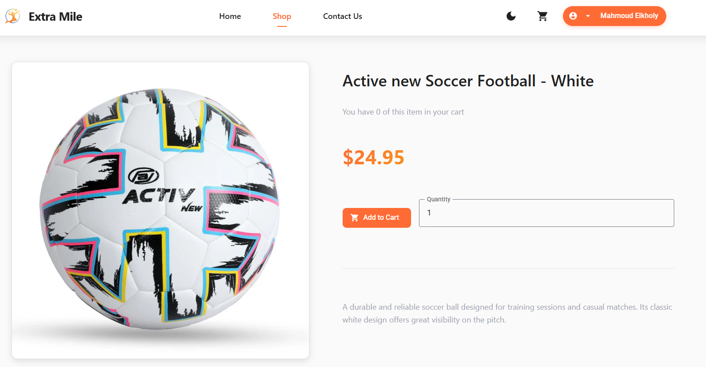

# 🛒 Extra Mile - E-Commerce Platform

**Extra Mile** is a modern e-commerce platform specialized in sports equipment and clothing.  
It is built with **.NET Core (API)** and **Angular (Frontend)**, featuring **Identity-based authentication**, **Vendor/Admin roles**, **Product management**, **Orders & Payments with Stripe**, and an integrated **AI Chatbot powered by Gemini**.

---

## 🚀 Features
- 👤 **User Roles**: Admin, Vendor, and Customer
- 🏪 **Vendor Dashboard**: Vendors can add products (pending approval by Admin)
- ✅ **Product Status Workflow**: Pending, Approved, Rejected, Suspended
- 📦 **Inventory Management** with real-time updates
- 💳 **Stripe Payment Integration**
- 🤖 **AI Chatbot (Gemini API)** for product Q&A and customer support
- 📊 **Admin Dashboard** with statistics and revenue tracking
- 🎥 **Video Hero Section** on the landing page

---

## 🛠️ Tech Stack
- **Backend**: ASP.NET Core 8, Entity Framework Core, Identity
- **Frontend**: Angular 20, TypeScript, Bootstrap/SCSS
- **Database**: SQL Server
- **Payments**: Stripe API
- **AI Chatbot**: Google Gemini API

---

## 🏗️ Backend Architecture

The backend follows a **Clean Architecture / DDD-inspired structure** with separation of concerns:

- **API Layer** (`API/`)  
  Exposes RESTful endpoints for Products, Orders, Account, Admin, Vendor dashboards, etc.

- **Core Layer** (`Core/`)  
  Contains Entities, Specifications, Interfaces, and Business Logic.

- **Infrastructure Layer** (`Infrastructure/`)  
  Handles Data Access with Entity Framework Core, Identity, and external integrations (Stripe, Gemini).

- **Persistence**  
  Uses `StoreContext` as the EF DbContext, applying configurations via `Fluent API`.

📌 **Pattern Highlights**  
- **Repository + Specification Pattern** for flexible querying  
- **Identity + JWT Authentication** with role-based authorization  
- **Caching** middleware for performance optimization  
- **Unit of Work** for transaction management

## ⚙️ Setup & Installation

### 1️⃣ Clone the Repository
```bash
git clone https://github.com/your-username/extra-mile.git
cd extra-mile


Backend Setup
cd API
dotnet restore
dotnet ef database update
dotnet run


# Apply migrations
dotnet ef database update

# Run the API
dotnet run --project API

Frontend Setup
cd client
npm install
ng serve -o


The backend runs by default at https://localhost:5001
The frontend runs at http://localhost:4200
```
### 🔑 Configuration (Secrets & Environment Variables)

To keep the project secure, sensitive keys (DB connection, Stripe, Gemini API) are not stored in source code.
You need to configure them before running the application.
so you need to replace them with your keys.

### 📊 Database Migrations
To apply database migrations:
```
dotnet ef migrations add InitialCreate -p Infrastructure -s API
dotnet ef database update -p Infrastructure -s API
```
# 🧑‍💻 Team Members

Mahmoud Ahmed Mohamed Mostafa – +20 109 087 2719

Mahmoud Amr Mahmoud Abo Elfotouh – +20 155 847 9001

Mohamed Adel Sayed Madbouly – +20 111 564 0508

Mohamed Mohamed Abd Elaziz – +20 101 067 5373

## 📷 Screenshots

### Home Page


### 🔑 Authentication
- **Register**
  

- **Login**
  

---

### 🛒 Shopping & Checkout
- **Cart Page**
  

- **Product Details**
  

- **Checkout - Address**
  

- **Checkout - Shipping**
  

- **Checkout - Payment**
  

- **Checkout - Confirmation**
  

- **Checkout - Receipt**
  

---

### 👤 User Features
- **User Orders**
  

- **Contact Us**
  

---

### 🏪 Vendor Features
- **Vendor Dashboard (1)**
  

- **Vendor Dashboard (2)**
  

- **Vendor - My Products**
  

- **Vendor - Add Product**
  

---

### 🛠️ Admin Features
- **Admin Dashboard (1)**
  

- **Admin Dashboard (2)**
  

- **Admin - Product Management**
  

- **Admin - Order Management**
  

- **Admin - Vendor Management**
  

- **Admin - Add Product as Vendor**
  

📌 Credits

Developed by Extra Mile Team 💚
